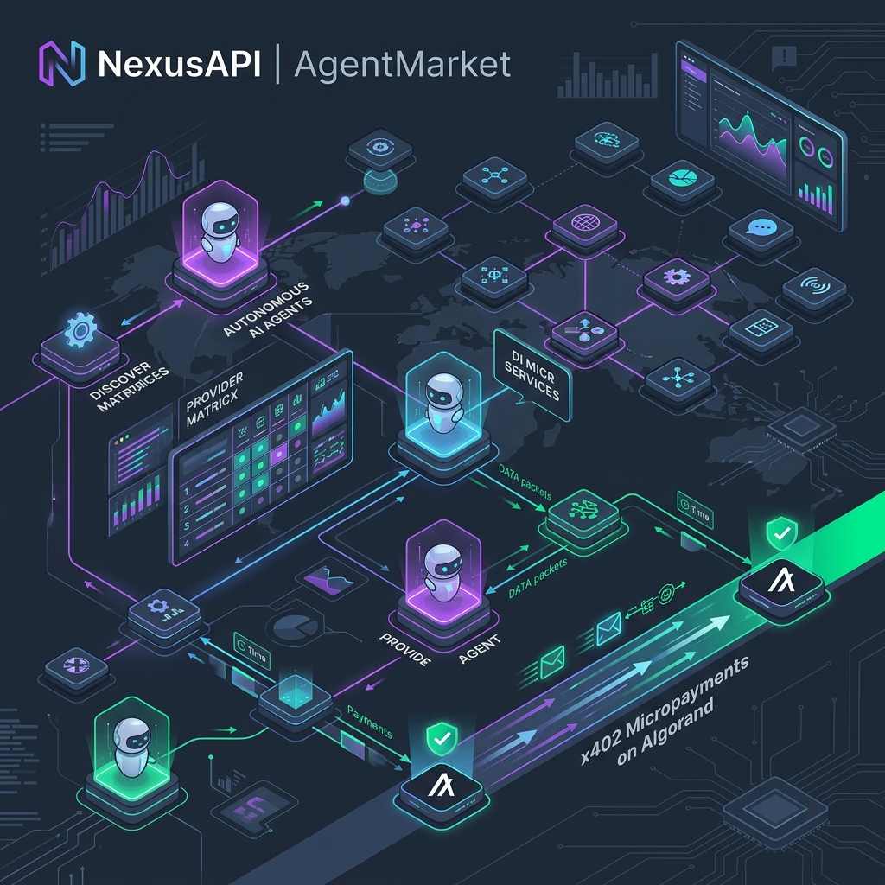

# CodeRush 2.0 | Team Project Readme

## 📋 Project Information

- **Team Name**: Arjuna
- **Project Title**: NexusAPI (AgentMarket — Pay-per-Use AI & Data API Marketplace)
- **Track/Theme**: Agentic Commerce / AI Infrastructure / Web3 Payments
- **Target Network**: Algorand TestNet
- **Wallet Support**: Lute Wallet (AVM TestNet transaction signer), Pera Wallet, Defly Wallet
- **Repository**: [https://github.com/patelmanan112/CodeRush2.0_arjuna](https://github.com/patelmanan112/CodeRush2.0_arjuna)

---



[](https://algorand.co)
[](https://x402.org)
[](https://nextjs.org)
[](https://deepseek.com)
[](https://www.typescriptlang.org)
[](https://www.docker.com/)
[](LICENSE)

---

## 💡 Project Overview & Problem Statement

### The Problem
In the emerging agentic economy, autonomous AI agents frequently require specialized micro-capabilities (such as OCR document extraction, multi-language translation, vector embeddings generation, location geocoding, risk scoring, or content moderation) to complete complex objectives. 

However, existing API distribution channels (e.g., AWS Marketplace, Hugging Face, OpenRouter) are built for humans: they require pre-negotiated recurring subscription relationships, credit card checkouts, API key secrets management, and constant human oversight. 

**There is currently no native framework enabling an AI agent to:**
1. **Autonomously Discover** active microservices and evaluate their suitability in real time.
2. **Dynamically Rank and Select** the best provider based on real-time price, quality score, availability, and latency parameters.
3. **Execute Pay-per-Request micro-billing** at the HTTP boundary, bound by local budgetary policies to prevent run-away costs.
4. **Verifiably Audit** transactions after execution via cryptographic receipt hashes showing what was paid for, which provider was selected, and what result was returned.

### The Solution: NexusAPI
**NexusAPI** solves this by establishing an end-to-end, trustless ecosystem for agentic commerce. It bridges the gap between AI models and decentralized Web3 payments through the **x402 HTTP micropayments protocol** built on the **Algorand blockchain**. 

Instead of manual human setup, a developer's agent is provided a prompt or task (e.g., *"Evaluate this transaction for fraud risk"* or *"Translate 'Hello World' into Hindi"*). The platform autonomously parses the prompt's intent, queries the provider registry, evaluates candidates against strict local spending caps, recommends the winning provider, initiates the on-chain AVM settlement payload via Lute/Pera/Defly Wallet signature, executes the sandboxed provider logic, and generates compliance invoices and cryptographic receipt assets.

---

## ✨ Key Platform Features

- 🤖 **13-Stage Autonomous Agent Pipeline**: Full end-to-end intent classification via DeepSeek V4 AI, provider SLA evaluation, budget verification, Algorand transaction construction, and execution rendering.
- ⚖️ **Provider SLA Comparison Matrix (`/compare`)**: Interactively compare providers side-by-side on price per call, response latency, quality score, uptime, rate limits, and feature matrices.
- 🎓 **Interactive Agent Advisor (`/agent-advisor`)**: Interactive wizard guiding users to configure spending policies, select optimal microservice categories, and generate custom agent execution profiles.
- 🛠️ **Provider Onboarding Portal (`/become-provider`)**: Enables third-party API developers to register their microservices, set endpoints, price per call (in micro-ALGO or USDC), rate limits, and receiving wallet address.
- 📊 **Developer Dashboard (`/dashboard`)**: Full management suite featuring live spending graphs (Recharts), budget policy controls, API key generator, transaction history, and detailed breakdown by category.
- 🔐 **Cryptographic Audit & Provenance Log (`/provenance`, `/trace`)**: Immutable audit trail matching SHA-256 hashes of input parameters, x402 payment nonces, transaction IDs, and response payloads.
- 📄 **PDF Invoice & Receipt Generator**: Native client-side and server-side PDF engine (`pdf-lib`, `qrcode`) producing itemized invoices with QR verification codes for enterprise compliance.
- 💳 **Web3 Wallet Integration**: Seamless support for Lute Wallet, Pera Wallet, and Defly Wallet using `@txnlab/use-wallet-react` and `@x402-avm` packages.

---

## 🛠️ Technical Stack

| Domain | Technologies |
| :--- | :--- |
| **Frontend Framework** | Next.js 15 (App Router), React 19, TypeScript (Strict Mode) |
| **Styling & UI** | Tailwind CSS v4, Framer Motion, Lucide Icons, Radix UI Components, Recharts, Sonner Toasts |
| **Backend Framework** | Node.js, Express.js, TypeScript (`tsx`), Helmet security headers, CORS |
| **Database** | MongoDB 6+ (Mongoose ODM, Local Daemon or MongoDB Atlas Cloud Cluster) |
| **AI Orchestration** | **DeepSeek V4 AI Model**: Dynamic Prompt Intent Classification & Parameter Extraction |
| **Protocol & Web3** | **x402 Micropayments Protocol** (`@x402-avm`), **Algorand TestNet** (Algonode API), **Lute/Pera/Defly Wallet** |
| **PDF & Utility** | `pdf-lib` (PDF generation), `qrcode` (QR rendering), `bcryptjs`, `jsonwebtoken`, Zod schema validation |
| **DevOps & Containerization**| Docker, Docker Compose, Vitest (Unit Testing), ESLint 9 |

---

## ⚙️ Architecture & Core Solution Flow

NexusAPI implements an autonomous 13-stage execution pipeline that processes an agent's plain text prompt into a verified microservice call with on-chain settlement:

```
                  ┌──────────────────────────────┐
                  │          USER TASK           │
                  └──────────────┬───────────────┘
                                 │
                                 ▼
                  ┌──────────────────────────────┐
                  │    DeepSeek Intent Parser    │  ◄── Classifies service category & parameters
                  └──────────────┬───────────────┘
                                 │
                                 ▼
                  ┌──────────────────────────────┐
                  │  Marketplace Query & Search  │  ◄── Queries database provider registry
                  └──────────────┬───────────────┘
                                 │
                                 ▼
                  ┌──────────────────────────────┐
                  │   Policy & Budget Check      │  ◄── Validates per-request cap & daily limits
                  └──────────────┬───────────────┘
                                 │
                                 ▼
                  ┌──────────────────────────────┐
                  │  Weighted Decision Matrix    │  ◄── Ranks candidates by cost, latency, quality
                  └──────────────┬───────────────┘
                                 │
                                 ▼
                  ┌──────────────────────────────┐
                  │   x402 Micropayments (AVM)   │  ◄── Prompts Wallet signed transaction
                  └──────────────┬───────────────┘
                                 │
                                 ▼
                  ┌──────────────────────────────┐
                  │  Simulated Provider Adapter  │  ◄── Runs category-specific code sandbox
                  └──────────────┬───────────────┘
                                 │
                                 ▼
                  ┌──────────────────────────────┐
                  │    ResultViewer & Exports    │  ◄── Visualizes output & builds PDF Invoices
                  └──────────────────────────────┘
```

### Detailed 13 Pipeline Execution Stages

| Stage | Name | Description |
| :--- | :--- | :--- |
| **1** | **Understanding Request** | Parses user prompt using DeepSeek V4 AI to extract target category, intent parameters, and constraints. |
| **2** | **Searching Marketplace** | Queries MongoDB provider registry for active, healthy providers registered under target category. |
| **3** | **Comparing Providers** | Fetches active SLAs including cost per request, latency (ms), uptime %, and quality rating (1-5). |
| **4** | **Running Policy Engine** | Enforces user spending rules: single-request cost limit, daily spending cap, and provider allowlist/blocklists. |
| **5** | **Running Decision Engine** | Computes multi-attribute Utility Score ($Score = w_1 \cdot Cost + w_2 \cdot Latency + w_3 \cdot Quality$). |
| **6** | **Selecting Provider** | Chooses top-ranked candidate and locks execution parameters and payment requirement payload. |
| **7** | **Creating Payment Session** | Generates x402 HTTP micropayment challenge header and crypto nonces. |
| **8** | **Waiting For Signature** | Triggers Web3 Wallet (Lute / Pera / Defly) transaction signing modal for AVM TestNet payload. |
| **9** | **Payment Confirmed** | Broadcasts transaction to Algorand TestNet via Algonode RPC and verifies transaction ID on-chain. |
| **10** | **Provider Executed** | Invokes provider execution sandbox adapter with query parameters and payment proof. |
| **11** | **Result Generated** | Transforms execution outputs into formatted visual components via `<ResultViewer />`. |
| **12** | **Receipt Generated** | Computes SHA-256 cryptographic receipt hash linking input parameters, payment ID, and output payload. |
| **13** | **Invoice Generated** | Assembles itemized PDF compliance invoice and audit receipt with QR validation code. |

---

## ⚡ Quick Start & Installation

You can run NexusAPI either via **Docker Compose** (recommended for production/demo) or manually using **Node.js & MongoDB**.

### Option A: Running via Docker Compose (Recommended)

Ensure Docker Desktop is installed and running, then execute:

```bash
# Clone repository
git clone https://github.com/patelmanan112/CodeRush2.0_arjuna.git
cd CodeRush2.0_arjuna

# Build and start all services (MongoDB, Express Backend, Next.js Frontend)
docker-compose up --build
```
Once running:
- **Frontend App**: [http://localhost:3000](http://localhost:3000)
- **Backend API**: [http://localhost:4000](http://localhost:4000)
- **MongoDB**: `localhost:27017`

---

### Option B: Manual Local Setup

#### Prerequisites
- **Node.js**: v18.0.0 or higher (v20 recommended)
- **npm**: v9.0.0 or higher
- **MongoDB**: Local daemon running at `mongodb://127.0.0.1:27017` OR a MongoDB Atlas cluster connection string.
- **Algorand Wallet**: Lute Wallet, Pera Wallet, or Defly Wallet Chrome extension connected to **Algorand TestNet** and funded via the [Algorand TestNet Dispenser](https://bank.testnet.algorand.network/).

#### 1. Clone the Repository
```bash
git clone https://github.com/patelmanan112/CodeRush2.0_arjuna.git
cd CodeRush2.0_arjuna
```

#### 2. Environment Configuration
Set up environment files in `BACKEND/.env` and `FRONTEND/.env` (templates provided below).

#### 3. Install Dependencies
```bash
# Install Frontend dependencies
cd FRONTEND
npm install

# Install Backend dependencies
cd ../BACKEND
npm install
```

#### 4. Seed Database
Populate MongoDB with 60 realistic microservice providers across 10 service categories:
```bash
cd BACKEND
npm run seed
```

#### 5. Launch Development Servers
Start both servers in separate terminal windows:

**Terminal 1 (Backend API Server):**
```bash
cd BACKEND
npm run dev
# Express server listening at http://localhost:4000
```

**Terminal 2 (Frontend Next.js App):**
```bash
cd FRONTEND
npm run dev
# Next.js web application running at http://localhost:3000
```

---

## 🔑 Environment Variables Reference

### Backend (`BACKEND/.env`)

| Variable Name | Description | Example / Default | Required |
| :--- | :--- | :--- | :---: |
| `PORT` | HTTP port for Express server | `4000` | Yes |
| `MONGODB_URI` | MongoDB connection URI | `mongodb://127.0.0.1:27017/x402-marketplace` | Yes |
| `JWT_SECRET` | Secret key for signing JWT auth tokens | `dev-secret-change-in-production` | Yes |
| `JWT_EXPIRES_IN` | JWT token validity duration | `7d` | No |
| `CORS_ORIGIN` | Allowed client origin for CORS | `http://localhost:3000` | Yes |
| `FRONTEND_URL` | Frontend client base URL | `http://localhost:3000` | Yes |

### Frontend (`FRONTEND/.env`)

| Variable Name | Description | Example / Default | Required |
| :--- | :--- | :--- | :---: |
| `NEXT_PUBLIC_APP_URL` | Base URL of frontend application | `http://localhost:3000` | Yes |
| `NEXT_PUBLIC_API_URL` | Express API endpoint | `http://localhost:4000/api/v1` | Yes |
| `NEXT_PUBLIC_HEALTH_URL` | Express API health check URL | `http://localhost:4000/health` | Yes |
| `DEEPSEEK_API_KEY` | DeepSeek AI API Key for intent parsing | `your_deepseek_api_key` | Optional |
| `NEXT_PUBLIC_ALGOD_SERVER` | Algorand Algod RPC node URL | `https://testnet-api.algonode.cloud` | Yes |
| `NEXT_PUBLIC_ALGOD_PORT` | Algod RPC port | `443` | Yes |
| `NEXT_PUBLIC_ALGOD_TOKEN` | Algod API token (blank for Algonode) | `""` | No |
| `NEXT_PUBLIC_ALGORAND_NETWORK` | Target Algorand network | `testnet` | Yes |
| `NEXT_PUBLIC_USDC_ASA_ID` | TestNet USDC Asset ID | `10458941` | Yes |
| `RESOURCE_PAY_TO` | Default provider payment receiver account | `36UMZNGBAZMINJH7266YYGHTR2OLEHTFRREB6ROQI3XA54EQXXCLTZTMG4` | Yes |

---

## 🔌 REST API Endpoints Reference

The backend Express server exposes a full RESTful suite:

### Health & Authentication
- `GET /health` — Check backend and MongoDB connection status.
- `POST /api/v1/auth/login` — Authenticate user and receive JWT session token.
- `GET /api/v1/auth/me` — Retrieve logged-in developer profile.

### Provider Catalog & Registration
- `GET /api/v1/providers` — List all registered microservices (supports `category`, `search`, `minRating`, `maxPrice` filters).
- `GET /api/v1/providers/:id` — Retrieve detailed SLA metrics and provider profile by ID.
- `POST /api/v1/providers` — Register a new third-party microservice endpoint.

### Spend Policies & Budgets
- `GET /api/v1/policies` — Retrieve active spending policy (daily budget cap, single-request cost cap, provider allowlists).
- `PUT /api/v1/policies` — Update user spending policy rules.
- `GET /api/v1/budgets/summary` — Get aggregated daily spend analytics and remaining budget allocations.

### Payments, Transactions & Receipts
- `POST /api/v1/payments/verify` — Verify x402 payment proof & Algorand transaction hash.
- `GET /api/v1/transactions` — List user's past execution transactions and payments.
- `GET /api/v1/receipts/:id` — Retrieve cryptographic SHA-256 receipt for a specific transaction.
- `GET /api/v1/pdf/invoice/:transactionId` — Download generated PDF invoice document.

### Analytics & System Metrics
- `GET /api/v1/analytics/overview` — System wide statistics (total calls, volume, active providers, category distribution).

---

## 🧩 Supported Microservice Categories

NexusAPI features **10 fully modeled microservice categories** with custom execution adapters and dynamic result visualizers:

1. 📄 **OCR (Optical Character Recognition)**: Document scanning, text extraction, invoice table parsing.
2. 🌐 **Translation**: Multi-lingual text translation (English, Hindi, Spanish, French, German, Japanese).
3. 🔢 **Vector Embeddings**: Generates high-dimensional floating-point semantic embeddings vector arrays.
4. ✍️ **Text Generation**: LLM text completion, summary creation, and prompt responses.
5. 🎙️ **Speech-to-Text**: Audio transcription, timestamping, and waveform confidence analysis.
6. 🎨 **Image Generation**: Synthetic text-to-image prompt generation and image rendering.
7. 🛡️ **Content Moderation**: Multi-vector safety classifier (toxicity, spam, profanity, adult content scoring).
8. 📊 **Risk Scoring**: Threat and fraud risk scoring engine returning LOW, MEDIUM, or HIGH risk flags.
9. 📍 **Geocoding**: Converts physical addresses to exact GPS latitude, longitude, and elevation.
10. 😊 **Sentiment Analysis**: Emotional tone breakdown (Positive %, Negative %, Neutral %).

---

## 🛡️ Security & Spending Protections

- **Dynamic Policy Enforcement**: Every request must pass through the Policy Engine before transaction payloads are presented to the wallet, preventing runaway loops or rogue AI expenditures.
- **Replay Protection**: x402 payment challenges include cryptographic single-use nonces tied to the target Algorand transaction hash, prohibiting double-spending or replay attacks.
- **Cryptographic Audit Provenance**: Each completed API request generates a SHA-256 hash derived from input parameters, provider ID, transaction hash, and response payload allowing offline verification.
- **Strict Zod Input Validation**: Provider registration forms, agent prompts, and payment signatures are strictly validated with Zod schemas to eliminate prompt injection and payload malformation.

---

## 🧪 Testing & Quality Assurance

Run type checking, linting, and unit tests across frontend and backend packages:

```bash
# Backend Unit Tests (Vitest)
cd BACKEND
npm test

# Type Checking (TypeScript --noEmit)
cd BACKEND && npm run typecheck
cd FRONTEND && npm run typecheck

# Code Formatting & Linting (ESLint)
cd BACKEND && npm run lint
cd FRONTEND && npm run lint
```

---

## 📂 Detailed Directory Structure

```
CodeRush2.0_arjuna/
├── README.md                      # Primary documentation
├── nexusapi_banner.png            # Platform architecture banner graphic
├── docker-compose.yml             # Docker multi-container orchestration
├── .env.example                   # Global environment variable template
│
├── FRONTEND/                      # Next.js 15 Web Application
│   ├── Dockerfile                 # Frontend multi-stage container build
│   ├── package.json               # Frontend dependencies & scripts
│   ├── public/                    # Static assets & graphics
│   └── src/
│       ├── app/                   # App Router Pages
│       │   ├── page.tsx           # Landing Page / Hero Section
│       │   ├── agent/             # 13 Execution Pipeline visualizer & step execution
│       │   ├── agent-advisor/     # Interactive AI Agent setup recommendation tool
│       │   ├── become-provider/   # Provider Registration Portal & Form
│       │   ├── compare/           # Side-by-Side Provider SLA Comparison Matrix
│       │   ├── dashboard/         # Developer Analytics & Policy Control Dashboard
│       │   ├── login/             # Auth Page with Google OAuth & Offline Fallback
│       │   ├── marketplace/       # Catalog Browsing & Filtering
│       │   ├── payment/           # x402 Micropayment Checkout Flow
│       │   ├── provenance/        # Cryptographic Audit Log & SHA-256 Verification
│       │   ├── providers/         # Comprehensive Provider Directory
│       │   └── trace/             # Step-by-Step Execution Visualizer & Timeline
│       ├── components/            # Reusable UI Components
│       │   ├── agent/             # Execution Timeline, Step Cards, ResultViewer
│       │   ├── Navbar.tsx         # Top Bar with Wallet Balances & Profile Status
│       │   └── ModeSelector.tsx   # Manual Purchase vs Autonomous AI Mode Toggle
│       ├── context/               # React State Management
│       │   ├── AuthContext.tsx    # Session state & JWT handling
│       │   ├── PaymentContext.tsx # Spend policies, budget caps, receipts
│       │   ├── AgentContext.tsx   # 13-Stage Pipeline State Machine
│       │   └── CompareContext.tsx # Selected providers comparison state
│       ├── hooks/                 # Custom React Hooks
│       │   └── useAlgorandBalance.ts # Live Algorand ALGO/USDC Balance Poller
│       ├── lib/                   # Utility Libraries & Provider Sandboxes
│       │   ├── data/              # Mock seed data fallbacks
│       │   ├── x402/              # x402 Client Handshake & Signature Parsers
│       │   └── providers/         # Category execution adapters (10 categories)
│       └── services/              # External Integrations
│           ├── agent/             # DeepSeek V4 Model Client & Ranking Engine
│           └── pdf/               # Client-Side PDF Invoice & Receipt Engine
│
└── BACKEND/                       # Node.js + Express REST API Server
    ├── Dockerfile                 # Backend container build
    ├── package.json               # Backend dependencies & scripts
    └── src/
        ├── app.ts                 # Express Application Middleware Setup
        ├── server.ts              # HTTP Server Entry Point
        ├── controllers/           # REST API Controllers
        ├── models/                # Mongoose Database Models (Provider, Policy, Transaction, User)
        ├── routes/                # Express Route Modules
        ├── services/              # Database Seeder & Core Business Logic
        └── test/                  # Vitest Automated Test Suites
```


---

## ❓ Troubleshooting Guide

| Symptom | Cause | Solution |
| :--- | :--- | :--- |
| **Lute / Pera Wallet won't connect** | Extension not installed or set to Algorand MainNet. | Open your wallet extension settings, switch network mode to **TestNet**, and refresh the page. |
| **Transaction Fails: Insufficient Balance** | Wallet ALGO testnet balance is 0. | Copy your wallet address and request test tokens from the [Algorand TestNet Dispenser](https://bank.testnet.algorand.network/). |
| **Backend MongoDB Connection Refused** | Local Mongo daemon is down or Docker container not started. | Run `mongod` locally OR run `docker-compose up` to launch the containerized MongoDB service. |
| **DeepSeek API Returns Fallback Result** | Missing `DEEPSEEK_API_KEY` in environment. | Supply your API key in `FRONTEND/.env` or let the built-in regex fallback parser handle intent extraction locally. |
| **CORS Policy Error on Fetch** | `CORS_ORIGIN` mismatch in `BACKEND/.env`. | Ensure `CORS_ORIGIN=http://localhost:3000` matches your Next.js app URL. |

---

## 🤝 Contributing

We welcome contributions, bug reports, and feature requests!

1. Fork the Project Repository
2. Create a Feature Branch (`git checkout -b feature/AmazingFeature`)
3. Commit your changes (`git commit -m 'Add AmazingFeature'`)
4. Push to the Branch (`git push origin feature/AmazingFeature`)
5. Open a Pull Request

---

## 📄 License & Acknowledgements

Distributed under the **MIT License**. See `LICENSE` for details.

### Acknowledgements
- **Algorand Foundation**: High-performance, low-latency AVM blockchain infrastructure.
- **x402 Protocol Community**: Standardized HTTP 402 payment headers specification.
- **DeepSeek AI**: Advanced intent classification models for agentic workflows.

